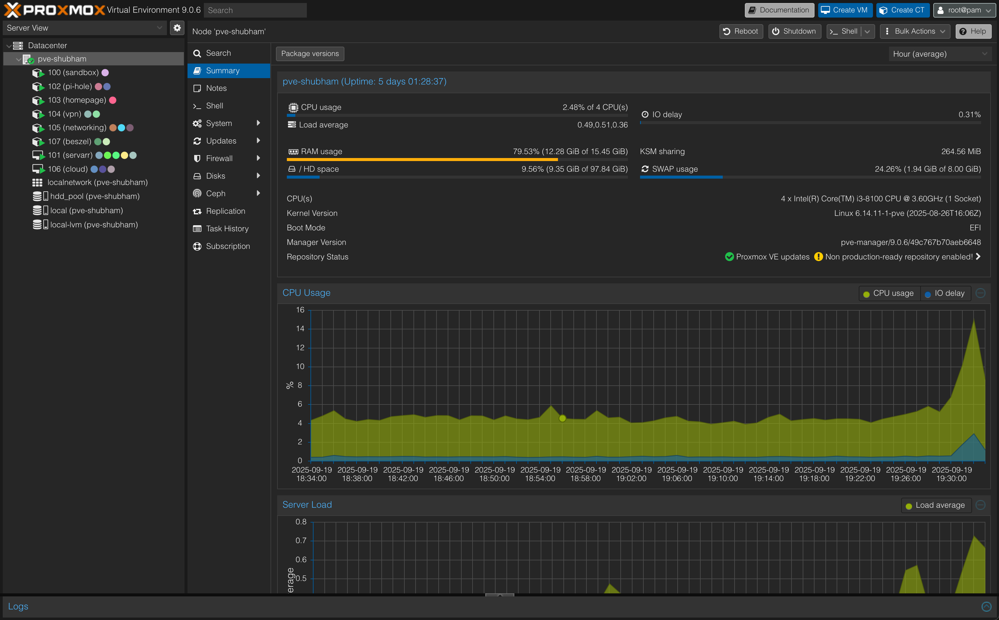
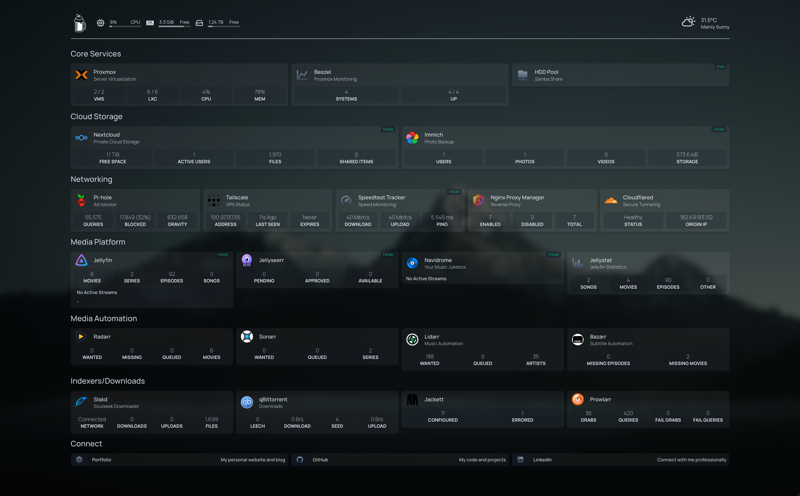
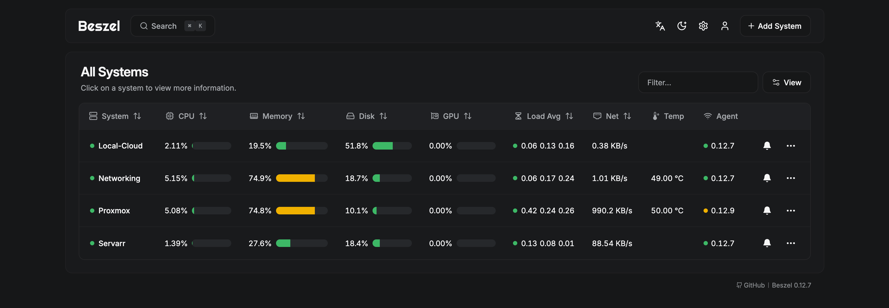
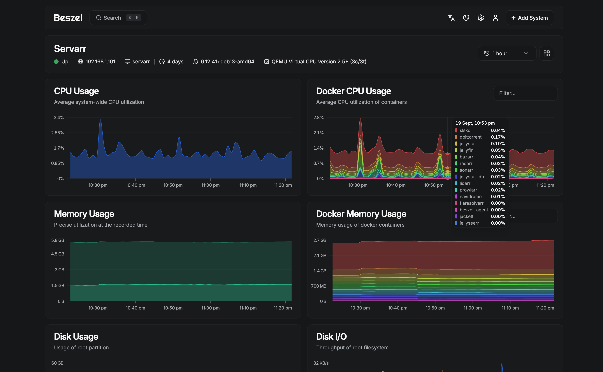
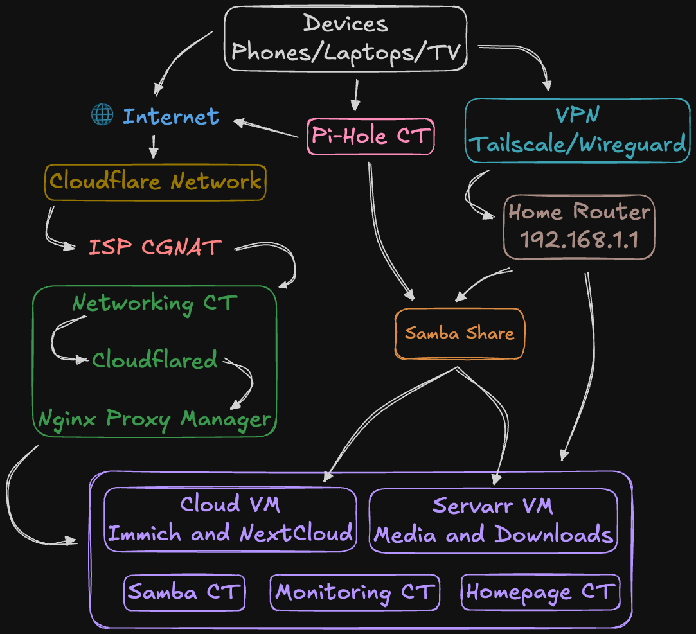
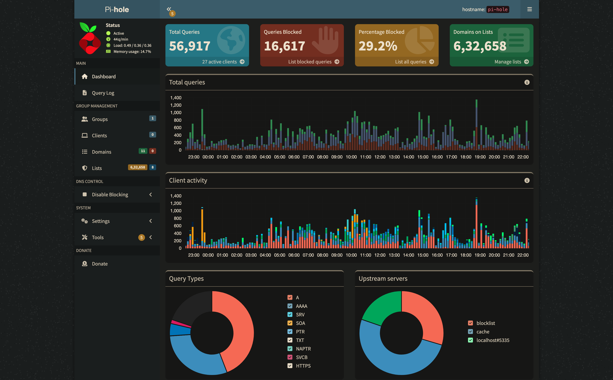
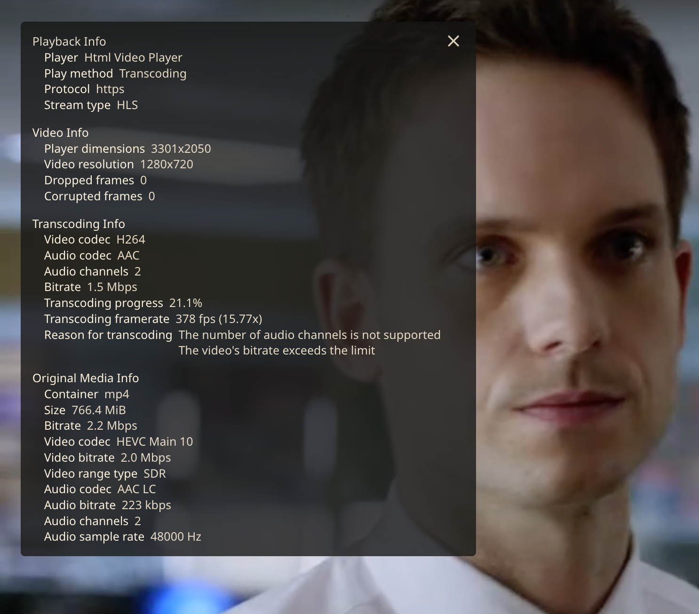

What started as a simple desire for digital privacy has evolved into a
comprehensive home server setup that handles everything from file storage to
media streaming, password management to DNS filtering. This is how me, a B.Com
background dove deep into the world of self-hosting on a budget and will help
guide you too.

In this post, I'll take you through my entire home server journey. From the
hardware choices and software setup to the networking challenges and service
configs. So, Whether you're a privacy first guy or a tech nerd on the hobby
side, wanting to learn about self-hosting, this guide has something for you.

## My Journey: From Commerce to Code

### The Privacy Awakening

My transition into the tech world wasn't traditional. With a background in
B.Com, I initially had little interest in technology beyond basic usage.
However, my love for youtube, and Linus' channel and tech trends gradually drew
me into the world of self-hosting.

It was with a Louis Rossman video that I realized how much personal data was
being collected and monetized, how many rights to repair were not being honored
and just monopoly stuff was happening by large corporations. So I got into this
new interest in taking control of my digital data, media, music and whatnot,
which eventually led me down the homelab side of the internet.

### Learning Through Building

What started as a simple desire to host my own cloud storage quickly snowballed
into a comprehensive infrastructure project. Each service I wanted to self-host
taught me something new:

- **File Storage**: Led me to learn about RAID, proxies, backups, and network
  protocols
- **Media Streaming**: Introduced me to transcoding, codecs, and bandwidth
  management
- **Password Management**: Taught me about security, encryption, and access
  control
- **DNS Filtering and Port forwarding**: Opened up networking concepts and
  traffic analysis

## Why Self-Host?

**Data Ownership**: Complete control and ownership of my personal data and
media  
**Privacy**: No third-party services scanning or monetizing my content  
**Cost Savings**: Get rid of monthly subscriptions and eventually overtime
surpass the costs in a +ve balance  
**Learning Experience**: Deep dive into infrastructure, networking, and system
administration  
**Customization**: Tailor services exactly to my wants and needs I guess?

## Hardware Foundation: Dell OptiPlex 3060 Micro

### Why This Business-Grade Mini PC?

After going through endless reddit threads,
[r/homelab](https://www.reddit.com/r/homelab/) and
[r/selfhosted](https://www.reddit.com/r/selfhosted/), talking to people on their
discord servers and then cost optimising, I settled on a **Dell OptiPlex 3060
MT** as my server foundation. Here's why this business PC made somehwat of a
compelling option for a 24/7 homelab:

### Server Specifications

- **Device**: Dell OptiPlex 3060 MT (used business PC)
- **CPU**: Intel Core i3-8100T (4 cores, 3.1GHz, 35W TDP)
- **RAM**: 16GB DDR4 (upgraded from 8GB)
- **Storage**: 512GB NVMe SSD + 1.5TB Internal HDDs
- **Network**: Gigabit Ethernet with static IP
- **Power**: 20-25W idle, 35-40W under load
- **OS**: Proxmox

### Hardware Advantages

**Power Efficiency**: Important to consider for 24/7 use and optimise for low
electricity costs  
**Silent Operation**: Minimal noise and enough cooling in most scenarios,
perfect for home use  
**Business Grade**: Reliable components designed for continuous operation for
professional use  
**Upgrade Path**: CPU upgradable to Intel i9 9th Gen, RAM expandable to 32GB and
3 SATA ports  
**Cost Effective**: Cheapest beginner gear for my homelab goals

### Storage Strategy

The current setup uses:

- **NVMe SSD**: Host OS (Proxmox) and container storage
- **External HDD**: Media files, backups, and bulk data
- **Future Plans**: Get 3 4TB Red NAS Drives, to run in Raid Z1, so I can have 1
  drive worth of parity and have 8TB usable storage

## Software Foundation: Proxmox

After evaluating various options, I chose **Proxmox** as my virtualization
platform. This hypervisor provides the perfect power and simplicity for this
purpose.

 _My Proxmox dashboard showing all
containers and VMs with overall usage_

### Why Proxmox?

**Professional Grade**: Enterprise virtualization with web management  
**Resource Efficient**: LXC containers use less resources than VMs  
**Backup Integration**: Built-in snapshot and backup capabilities  
**Learning Value**: Exposure to enterprise-level concepts  
**Community Support**: Excellent documentation and ofcourse YouTube guides

### Container Strategy

I run most services in **LXC containers** rather than VMs for better resource
efficiency. Each class of services gets its LXC with dedicated CPU, memory, and
storage allocations.

Here's my config files for the same to help you:  
**📋 [Complete Proxmox Setup Guide](https://github.com/shubhpsd/homelab/tree/main/proxmox)**

## Ecosystem Overview

My home server runs **20+ services** across 7 organized LXCs/VMs, all managed
through a quickly overviewed from my Homepage dashboard. Here's a look at the
dashboard:

 _Homepage dashboard organized by
category with real-time monitoring, also visible at
[dash.shubhamprasad.me](https://dash.shubhamprasad.me/)_

### Categories

**Core Services**: Proxmox, monitoring, and Samba share  
**Cloud Storage**: Nextcloud (personal cloud) and Immich (photo backup)  
**Networking**: Pi-hole (ad blocking), VPN, speedtest and proxy management  
**Media Platform**: Jellyfin (movies/TV), Jellyseerr (show requests), Navidrome
(music), and Jellystat (watch stats)  
**Media Automation**: Complete \*arr stack for automated content management  
**Download Management**: qBittorrent, indexers, and specialized downloaders

Each service includes custom widgets showing real-time stats like storage usage,
active users, download progress, and system health.

Please refer to my config to get an idea and setup your own version:  
**📋 [Complete Homepage Configuration](https://github.com/shubhpsd/homelab/tree/main/homepage)**

## Monitoring: Keeping Everything Running

With 20+ services running, monitoring is crucial. I've used beszel for
monitoring that gives me complete visibility into system health and performance
aesthetically.

  _Beszel
dashboard showing real-time system metrics and container resource usage_

### System Monitoring with Beszel

**Beszel** provides lightweight, beautiful system monitoring without the
complexity of Prometheus/Grafana. It tracks:

- **System Resources**: CPU, memory, disk usage, and network statistics
- **Container Metrics**: Individual Docker container resource consumption
- **Historical Data**: Performance trends and resource usage over time
- **Alert System**: Notifications when services exceed thresholds

Both tools are documented in my monitoring configuration:  
**📋 [Complete Monitoring Setup](https://github.com/shubhpsd/homelab/tree/main/monitoring)**

## Networking: Getting over CGNAT

### The Problem: CGNAT Limitations

My biggest challenge? **Carrier-Grade NAT (CGNAT)** from my ISP, Airtel and I
talked around, and mostly every ISP in India does the same. No public IP, no
port forwarding, no easy way to access my server from outside. It felt
frustrating man.

But every problem has a solution...

### The Game Changer: Cloudflare Tunnels

Cloudflare Tunnels became my solution. They create secure connections between my
server and the internet without exposing my home IP or requiring any router
configuration.

**Network Traffic Flow:**

**How it works:**

1. **External Request**: User visits `jellyfin.shubhamprasad.me`
2. **Cloudflare CDN**: Routes traffic through their global network
3. **Home Network**: Cloudflare tunnel connects to my home router
4. **Tunnel LXC**: Cloudflare daemon running in dedicated container
   (192.168.1.x)
5. **Nginx Proxy Manager**: Receives traffic from tunnel, handles SSL/routing
6. **Pi-hole DNS**: All internal DNS queries go through Pi-hole for ad blocking
7. **Target Service**: Traffic reaches Jellyfin, Nextcloud, etc. on their local
   IPs

**The solution:** A simple Docker stack with Nginx Proxy Manager and Cloudflare
Tunnels that handles all the complexity behind the scenes.

**What this setup provides:**

- **SSL Certificate Management**: Automatic Let's Encrypt certificates for all
  services
- **Reverse Proxy Power**: Routes for example, `dash.shubhamprasad.me` to my
  Homepage dashboard
- **Zero Trust Security**: No open ports on my router
- **Global Performance**: CDN acceleration from Cloudflare's worldwide network

### DNS Filtering: Pi-hole + Unbound

Network-wide ad blocking that makes every device on my network browsing
experience faster and more private.

**My current blocking performance:**

- **~30% of DNS queries blocked** daily (that's a lot of ads!)
- **600,000+ domains** on my blocklist
- **Sub-10ms query response** times
- **DNSSEC validation** with Unbound for enhanced security

### Remote Access: Tailscale/Wireguard VPN

When I'm away from home, Tailscale/Wireguard creates a private mesh network that
allows my network to assume I'm sitting right at my home desk.

**What I can do remotely:**

- SSH into any server part
- Administer my servers from my phone
- Control home automation while traveling

### The Results Speak for Themselves

**Performance Metrics:**

- **Uptime**: 99.9% (better than many paid services!)
- **Load Times**: Faster than most hosted alternatives
- **Security**: Zero failed intrusion attempts
- **Cost**: $0/month just a one time time and effort cost

**Service Access Points:**

- `dash.shubhamprasad.me` → Homepage Dashboard
- `nextcloud.shubhamprasad.me` → Cloud Storage
- `photos.shubhamprasad.me` → Photo Management
- `jellyfin.shubhamprasad.me` → Media Streaming
- `jellyseerr.shubhamprasad.me` → Requesting downloads of shows/movies
- `music.shubhamprasad.me` → Music Server
- `speedtest.shubhamprasad.me` → Home network speedtest

### Want the Technical Deep Dive?

The networking setup is complex, but I've documented every step for you:

**📋
[Complete Networking Configuration Guide](https://github.com/shubhpsd/homelab/tree/main/networking)**

This comprehensive guide covers:

- Complete Docker Compose setup with environment configuration
- Step-by-step Cloudflare tunnel creation and configuration
- Nginx Proxy Manager host setup with SSL automation
- Pi-hole installation with Unbound recursive DNS
- Tailscale/Wireguard mesh network configuration

## The Remaining Fun Apps

Now comes the fun part the LEGAL services that make this thing worthwhile!
Here's what I'm running:

### Samba File Share

Network-attached storage accessible from Windows, macOS, and Linux devices.
Perfect for transferring files, sharing media across the network, and providing
centralized storage access to all family devices.  
**Homepage Dashboard**: My mission control center. One beautiful interface to
monitor and access all 20+ services. Real-time stats, quick links, and a
professional look that impresses visitors.

### Cloud & Storage Services

**Nextcloud**: My personal Google Drive replacement. File sync across all
devices, calendar, contacts, notes, and even office suite integration. Zero
monthly fees, unlimited storage.  
**Immich**: Think Google Photos but completely private and free. AI-powered
facial recognition, automatic mobile backup, and blazing-fast search through
thousands of photos.

### Media & Entertainment

#### TV/Movies

**Jellyfin & Jellyseerr**: My personal Netflix. Stream movies, TV shows, and
home videos to any device. I've passed through the Intel GPU to the Jellyfin VM
for hardware transcoding, ensuring smooth playback even on older devices while
keeping CPU usage minimal.

#### Music

**Navidrome**: Personal Spotify server. My entire music collection accessible
from any device with a beautiful web interface and mobile app support through
**Amperfy**. Unlike movies and TV shows, finding good quality music was
surprisingly difficult.  
I initially tried Lidarr for automation, but then discovered **SLSKD**, which is
just a beautiful community driven solution for music discovery and acquisition.

#### Media Automation

**Sonarr**: Automated TV show management. Monitors release calendars, searches
for episodes, downloads them automatically, and organizes your TV library with
proper naming and metadata.  
**Radarr**: Movie automation counterpart to Sonarr. Manages movie collections,
monitors for releases, handles quality upgrades, and maintains a beautifully
organized movie library.  
**Prowlarr**: Indexer manager that feeds both Sonarr and Radarr. One central
place to manage all your torrent trackers and Usenet indexers, with automatic
syncing across the \*arr stack.  
**Jackett**: Alternative indexer proxy that translates queries from apps like
Sonarr and Radarr into tracker-specific searches. Works alongside Prowlarr to
provide access to even more indexer sources.  
**Bazarr**: Subtitle automation for your media. Automatically downloads
subtitles for movies and TV shows in multiple languages, ensuring you never miss
dialogue.

The entire \*arr stack works together seamlessly - Prowlarr and Jackett finds
sources, Sonarr/Radarr handle the automation, and Bazarr adds the finishing
touch with subtitles. It's like having a personal media librarian that never
sleeps!

**📋
[Complete Media Stack Configuration](https://github.com/shubhpsd/homelab/tree/main/media)**

#### Watchtime and other stats

**Media Organization and Statistics**: Automated downloading, organizing,
quality management and statistics for all media content.

### Speedtest

Local home network speedtest tracker and historical tracking aswell

Want to see the complete technical setup? All the Docker configurations,
environment files, and step-by-step guides?  
Find them here and help yourself:
[GitHub repository](https://github.com/shubhpsd/homelab)

- Docker Compose templates
- Environment configuration examples
- Performance optimization tips
- Troubleshooting guides - Troubleshooting guides

## Real-World Impact

### Daily Life Benefits

This isn't just a tech project, it was a privacy and cost optimisation path.

**Work Productivity**: Secure access to all my files from anywhere. No more "I
left that file on my home PC" moments.  
**Family Photos**: Automatic backup of everyone's phones. Never lose access to
another precious memory, and easily share albums with family.  
**Entertainment**: Our own Netflix with no monthly fees. Movies, TV shows, and
music available instantly throughout the house on all TVs, Laptops, Phones
whatever.  
**Privacy**: Complete control over our data. No tech giants scanning our photos
or reading our files.  
**Learning**: Invaluable hands-on experience with enterprise technologies that
helps my knowledge and career?

### Cost Analysis

**Initial Investment**: ₹9500 (~$100) for the Dell OptiPlex and ~₹30,000
~(~$300) total for the future storage upgrades  
**Monthly Savings**: ~₹1800 ~(~$20+) (replacing multiple cloud subscriptions)  
**Break-even**: 20 months  
**Ongoing Costs**: Less than ~₹250/month ~(~$5/month) in electricity

Compare that to (Indian Pricing):

- Netflix: ₹649/month
- Google One: ₹130/month for 100GB
- YT Premium/Music: ₹149/month
- Additional cloud storage: ~₹900/month

## Lessons Learned from the Journey

### Technical Insights

**Start simple, scale gradually**: I began with just Jellyfin and Pi-hole.
Adding services one by one helped me understand each component before building
complexity.  
**Documentation saves hours**: Keeping detailed setup notes in my GitHub
repository has been invaluable for troubleshooting and helping friends set up
their own systems.  
**The community is incredible**: r/selfhosted, r/homelab, YouTube, and Discord
servers provided answers to every question I had. The self-hosting community
genuinely wants you to join them.

### Personal Growth

**From commerce student to sysadmin**: This project taught me more about
networking, Linux, and system administration than any course could. The hands-on
learning is irreplaceable.  
**Patience with troubleshooting**: Not everything works on the first try.
Learning to read logs, search for solutions, and methodically debug issues has
been incredibly valuable.  
**Privacy awareness**: Running my own services made me realize how much personal
data I was giving to big tech companies. Now my family's photos, files, and
browsing data stay under our control.  
**Cost consciousness**: Tracking the real costs versus cloud subscriptions
showed me that self-hosting isn't just about privacy - it's genuinely more
economical for heavy users.

### Future Expansion Plans

- **Storage growth**: Planning a for some HDDs to expand and help with data
  parity
- **Home automation**: Adding Home Assistant for smart home integration and also
  get some smart home appliances
- **Enhanced monitoring**: More detailed metrics and alerting
- **Backup improvements**: Off-site backup strategy for disaster recovery, edge
  case handling am i right?

## Conclusion

**The real magic isn't in the technology itself** - it's in the independence it
provides. No more worrying about cloud storage limits, streaming service price
hikes, content removal or privacy violations. My digital life is truly under
control.

If you're considering starting your own homelab journey, my advice is simple:
**start small and start today**. Pick one service that solves a real problem for
you, pick up an old laptop, and build from there. The skills you'll develop and
the satisfaction you'll gain are worth far more than the money you'll save.

Everything is documented in my
[GitHub repository](https://github.com/shubhpsd/homelab) - Docker configs,
troubleshooting guides, and step-by-step setup instructions.

---

_Have questions about any part of this setup? Found this helpful and want to
share your own homelab story? Reach out through the contact page or connect with
me on social media. I'd love to hear about your self-hosting adventures!_
